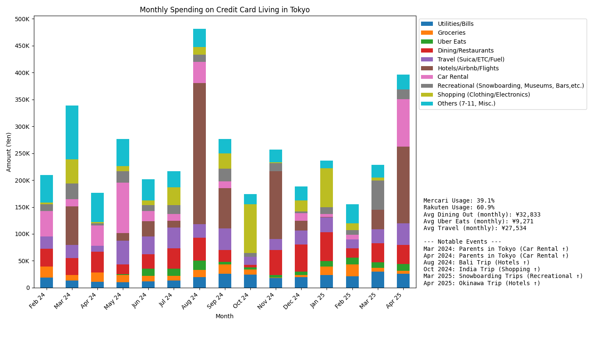

# Credit Card Statement Analysis

This project analyzes my spending habits for the last 14 months by extracting transaction data from credit card statements (PDFs) and email confirmations (.eml files). It cleans, categorizes, and visualizes the data to provide insights into monthly spending patterns.

## Steps

- Extracts data from Rakuten Card PDFs and Mercari Card Emails.
- Cleans and standardizes transaction data.
- Categorizes transactions based on customizable keywords.
- Generates a stacked bar chart visualizing monthly spending by category.

## Output

## Setup and Usage

1.  **Organize Data:** Place your PDF statements in `data/raw/Rakuten` and `.eml` files in `data/raw/Mercari`.
2.  **Install Dependencies:** (Add your dependency management instructions here, e.g., `pip install -r requirements.txt`)
3.  **Customize Categories:** Modify `config/category_keywords.py` to adjust spending categories and associated keywords.
4.  **Run Analysis:** Execute the main script (e.g., `python main.py`) to process the data.
5.  **Generate Visualization:** Run the visualization script (e.g., `python visualize.py`) to create the graph in the `outputs/figures/` directory.
